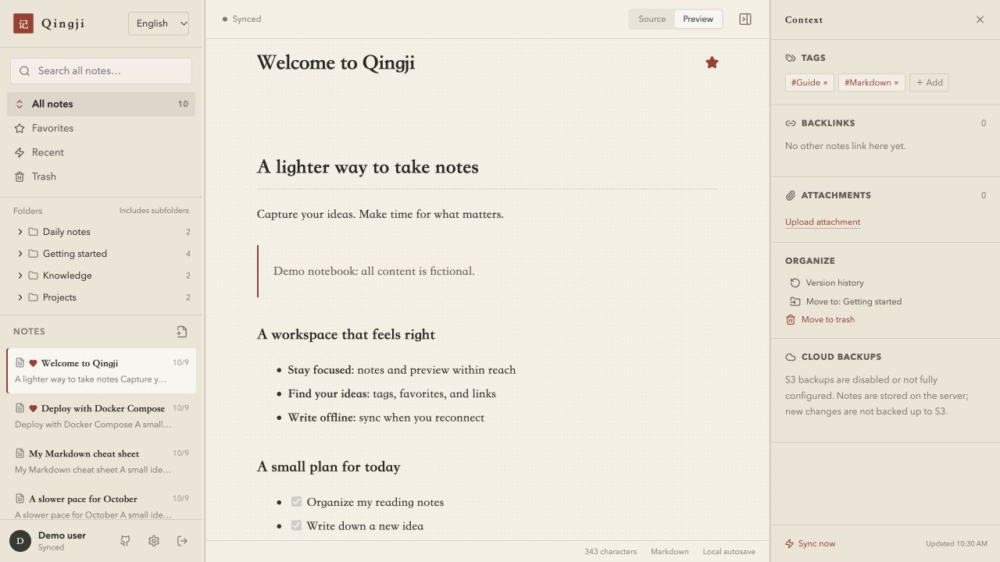
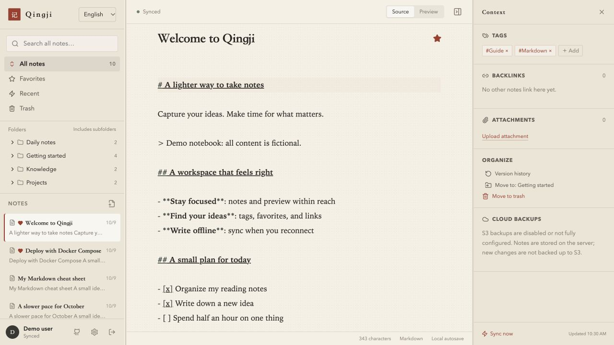

# Qingji · 轻记

[简体中文](README.md) | [English](README.en.md) | [日本語](README.ja.md)

**A cleaner, smoother Joplin alternative. Deploy with Docker Compose, write in your browser, and keep going offline.**

Qingji is a personal Markdown notebook that brings writing, search, multi-device sync, and S3 backups into a simple web app. Deploy it once and access the same address from multiple computers. Notes and attachments stay on your own server; enable S3 when you need it.

## Screenshots

These screenshots show the actual application running with a separate demo notebook. The account, note titles, and content are all fictional.

**Reading view** · Folders, the note list, rendered Markdown, and context tools in one workspace.



**Markdown editor** · Switch between source and preview, with local autosave and incremental sync.



## Why Qingji

- **A pleasant place to write.** Browse folders, find notes, and switch between editing and preview in one workspace. Tags, favorites, internal links, and backlinks help you stay organized. Customize the app name and image logo, too.
- **Less loading, easier navigation.** Folder metadata and note bodies load separately, with bodies fetched on demand. The browser caches loaded content, a Worker builds the catalog index, and static assets are compressed and cached to reduce repeated loading and main-thread work.
- **Sync after editing, without waiting for S3.** Local changes trigger a debounced push to the server after roughly 650 ms; cursor-based pulls fetch only new changes. Writing across devices does not wait for object-storage backups. Pending edits upload when connectivity returns, and conflicts retain a separate copy.
- **Keep writing offline.** An initialized browser supports offline note creation, editing, and deletion, followed by incremental sync when it reconnects. A temporary outage does not interrupt text editing.
- **More economical S3 backups.** The server batches changes from multiple devices, reuses objects by content hash, and uploads only the difference. Unchanged content skips a new snapshot; cached hashes and periodic full reconciliation reduce repeated reads, writes, transfers, and verification work.
- **Simple deployment, your own data.** One Docker Compose startup command builds the frontend and backend, starts the services, and checks their health. Markdown and original attachments are stored directly on disk, with note history, trash, and full export available.

## Find within a note

Click the article or enter the editor, then press **Ctrl+F** (**⌘F** also works on Mac) to search the current note. Source mode searches raw Markdown; preview mode searches rendered body text. Matches are counted and highlighted, with case sensitivity, Enter / Shift+Enter navigation, and Esc to close. Switching modes preserves the query. When focus is outside the article, such as in the sidebar, the browser’s default find remains available.

## Interface languages

Supports Simplified Chinese, English, and Japanese. The first visit follows your browser language, falling back to English for unsupported languages. Switch on the sign-in page, at the top-left of the workspace, or in Settings → Appearance. Your choice is saved in this browser and takes effect without reloading. Note content, titles, tags, and custom app names are not translated.

## Quick deployment with Docker Compose

**Install Git, Docker, and Docker Compose, then set a password. No Node.js, Python, or database installation is needed on the host.**

```bash
git clone https://github.com/gallonyin/qingji.git
cd qingji
cp .env.example .env
# Edit .env and set MYNOTE_PASSWORD to your own password.
# The defaults are suitable for http://localhost:8080 on this computer.
docker compose up -d --build --wait
```

Once startup completes, open **<http://localhost:8080>** and sign in with your password. The first startup downloads base images, installs dependencies, and builds the app. Subsequent starts can use `docker compose up -d --wait`. Data is stored in `./data/` on the host by default. S3 is optional: configure it later in the web settings.

Common commands:

```bash
docker compose logs -f        # Follow logs.
docker compose stop           # Stop the services.
docker compose up -d --wait   # Start them again.
```

For a server deployment, set `MYNOTE_ORIGIN` in `.env` to the actual web origin: scheme, hostname, and any non-default port, without a path. For public access, use an HTTPS reverse proxy and set `MYNOTE_COOKIE_SECURE=true`. Offline refresh requires HTTPS or localhost; a remote page over plain HTTP cannot enable the Service Worker.

Before upgrading, stop the services and back up the entire `data/` directory. Then pull the code and run `docker compose up -d --build --wait` to upgrade the frontend and backend together. Only one service process may write to a data directory, and only one server may own an S3 prefix.

## What you gain when switching from Joplin

Qingji focuses on **personal Markdown writing, access from multiple computers, self-hosting, and off-site S3 backups**. If you already use Joplin notebooks, tags, and internal links, the organization will feel familiar, with a more direct everyday workflow.

| What matters to you | How Qingji helps |
| --- | --- |
| A cleaner writing experience | Folders, notes, editing, and preview share one workspace, with common actions close at hand. |
| Access from another computer | Deploy one service and open it in a browser. S3 settings stay on the server; each browser does not need its own bucket and credentials. |
| Opening and switching notes | Load folder metadata first, fetch bodies on demand, and reuse local caches. Cached text remains editable offline. |
| Getting edits to other devices | Editing triggers incremental pushes; reconnecting uploads pending changes. Other devices pull changes incrementally, with visible pages checking roughly every 30 seconds and a manual sync button available. |
| Keeping S3 out of everyday sync | Browsers sync with the server, which backs up to S3 separately. Object-storage latency is outside the normal note-sync path. |
| Less duplicate storage and transfer | Identical content shares SHA-256 objects across snapshots. Consecutive changes are batched, and only new content objects are uploaded. |
| Better scheduling of verification | Routine backups scan metadata and reuse confirmed hashes and upload records. Full reconciliation is due every seven days by default and runs during the next backup; restores verify each file with SHA-256. |
| Visible backup costs | Request counts, transferred bytes, elapsed time, and stages are shown. Compressed manifests, conditional requests, and retention cleanup make requests, traffic, and storage easier to control. |
| Bringing existing notes along | A read-only importer for a local Joplin profile preserves folders, titles, tags, attachments, and internal links, leaving the original data available for comparison. |

Joplin's [S3 mode](https://joplinapp.org/help/apps/sync/s3/) uses object storage as a client synchronization target. Qingji separates multi-device sync from S3 backups. This reduces everyday sync's dependency on S3, centralizes backup management, and avoids repeated work. Actual costs depend on notebook size, editing frequency, retention, and your provider's pricing.

Joplin also offers a [web app](https://joplinapp.org/help/apps/web/) and [end-to-end encryption](https://joplinapp.org/help/apps/sync/e2ee/). Qingji currently focuses on a single-user web notebook. It does not provide end-to-end encryption, Joplin plugin compatibility, or complete feature parity. The experimental Tauri shell has not been validated as a desktop release.

See [Migrating from a local Joplin profile](docs/migration-run.md). Verify notes and attachments in a separate instance before switching your daily workflow.

## App settings

After signing in, click the gear in the lower-left corner to change the app name and image logo or configure optional S3 backups. Settings include a connection and permissions test, automatic backups, and snapshot retention, and take effect after saving. The account area and About page link to the [GitHub project](https://github.com/gallonyin/qingji). See [Settings](docs/settings.md).

## Data and backups

```text
data/
├── notes/                       # Current Markdown notes, including trash
├── attachments/                 # Original attachments
├── settings.json                # Branding and S3 settings, including credentials;
│                                # created when settings are first saved
├── metadata.sqlite              # History, sessions, indexes, and sync records
├── backup-jobs.json              # Background jobs
├── backup-cache.sqlite           # Incremental backup cache
└── backup-observability.sqlite   # Job statistics
```

Markdown files and attachments hold the current content. History, sessions, and sync state also depend on SQLite. Losing the database allows rebuilding the current-note index, but not the complete history.

S3 provides server-side off-site backups, separately from browser-to-server sync. It is disabled by default. Configure a dedicated bucket or prefix in Settings, or initially set `S3_BACKUP_ENABLED=true` through the environment. Automatic backups also require `S3_BACKUP_SCHEDULE_ENABLED=true`. By default, backups run after 60 seconds without changes, with a maximum wait of 10 minutes during continuous editing. A fallback check runs every 24 hours and skips unchanged content. Full reconciliation becomes due every 168 hours and runs during the next backup, rather than scanning the whole bucket daily.

The latest 30 ordinary snapshots are retained by default; protected snapshots are kept in addition. Unreferenced objects are removed after successful publication and manifest validation. S3 currently contains only `notes/` and `attachments/`, **not the history database**. For a complete cold backup, stop the services and copy the entire `data/` directory, including any SQLite WAL/SHM files. Restore a cold backup with the services stopped, replacing the directory as a whole rather than swapping a live database.

See [S3 backups](docs/s3-backup.md), [Restore safeguards](docs/backup-safety.md), [Note history](docs/note-history.md), and [Joplin migration](docs/migration-run.md).

## Current limitations

- A browser must sign in and initialize online before its first offline use. Offline attachment uploads are not supported yet; text editing is. Cached content consumes browser storage, and signing out does not clear the cache. Clear site data separately on shared computers.
- This is not a collaborative editor. It has no user data isolation, public sharing, CRDT, or end-to-end encryption. Concurrent edits from multiple browsers can produce conflict copies. The sign-in name is for display only.
- JSON requests are limited to roughly 1 MiB by default, and individual uploads to 25 MiB. Some file operations read an entire file into memory; large attachments and very large notes are not current optimization targets.
- Search currently scans server-side data in memory, and initial sync downloads folder metadata. Performance depends on data size and should be measured with your own workload.
- Creating a consistent local backup snapshot briefly queues writes; editing can continue during upload. A full restore blocks server writes. There is no shared-directory multi-process lock or complete guarantee against power-loss failures.

See the [Publication review](docs/publication-review.md) for checks and limitations recorded during release preparation.

Further reading: [Security boundaries](SECURITY.md), [Contributing](CONTRIBUTING.md), [File format](docs/data-format.md), and [Sync protocol](docs/sync-protocol.md). These supporting documents are currently in Chinese.

## Local development

Requires Node.js **20.19+**; Node.js 22 is recommended. Python 3 is only needed for migration and its tests.

```bash
npm ci
cp .env.example .env
# Edit .env and set your own MYNOTE_PASSWORD.
# The placeholder password cannot start the server.
npm run dev
```

Open <http://localhost:5173>. The server listens on port 8787, and the web app proxies requests through `/api`. The server entry point reads the root `.env`; existing process environment variables take precedence. Restart the services after changing configuration.

```bash
npm run typecheck
npm test
npm run build
python3 -m unittest discover -s scripts/tests
npm audit --registry=https://registry.npmjs.org
```

## License and compatibility

Licensed under [MIT](LICENSE). The display name is Qingji (轻记). Existing `MYNOTE_*` configuration, `@mynote/*` workspace names, browser storage keys, and the S3 `mynote/` prefix remain compatible. No data migration is required for the name change.
