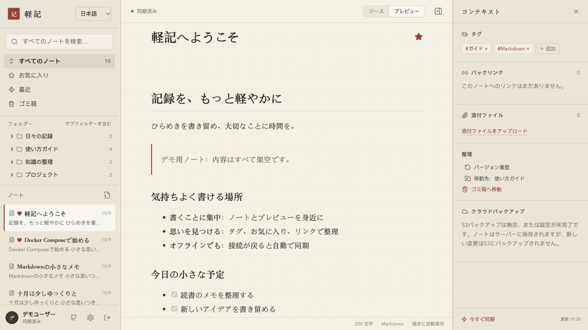
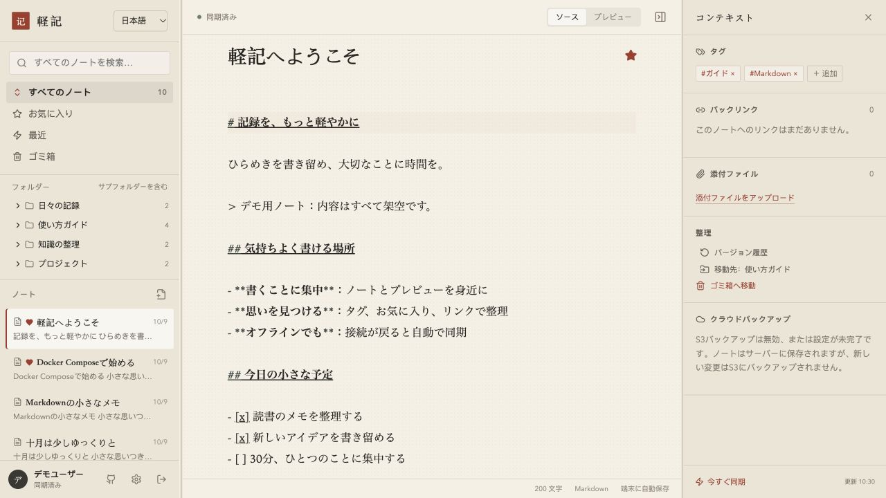
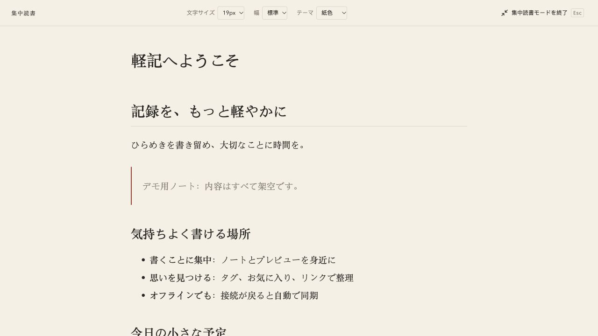

# Qingji · 軽記

[简体中文](README.md) | [English](README.en.md) | [日本語](README.ja.md)

**すっきりした画面で、気持ちよく書ける Joplin の代替アプリ。Docker Compose で導入し、ブラウザーで書き、オフラインでも続けられます。**

Qingji（軽記）は、文章作成・検索・複数端末での同期・S3バックアップをまとめた個人用Markdownノートです。一度デプロイすれば、複数のパソコンから同じURLでアクセスできます。ノートと添付ファイルは自分のサーバーに保存し、S3は必要に応じて有効にできます。

## 実際の画面

実際に動作するアプリを、独立したデモ用ノート庫で撮影しています。アカウント・ノートのタイトル・本文はすべて架空のものです。

**ログイン画面** · 紙色のフォームと墨色の背景で、アプリを開いた瞬間から落ち着いて書ける雰囲気に。


**プレビュー** · フォルダー、ノート一覧、本文、コンテキストパネルを1つのワークスペースに。



**Markdown編集** · ソースとプレビューを切り替え、端末への自動保存と差分同期で作業を続けられます。



## 軽記を使う理由

- **見やすく、書きやすい。** フォルダー、ノート一覧、編集、プレビューを同じ画面に配置。タグ、お気に入り、内部リンク、バックリンクで内容を整理できます。アプリ名とロゴ画像も変更できます。
- **読み込みを減らし、移動を軽く。** フォルダー情報と本文を分け、本文は必要になったときに読み込みます。ブラウザーのキャッシュ、Workerでのインデックス作成、静的ファイルの圧縮とキャッシュで、繰り返しの読み込みやメインスレッドの負担を減らします。
- **編集したら同期。S3の完了を待ちません。** 端末の変更は約650ミリ秒の待機後にまとめてサーバーへ送信し、カーソルで差分を取得します。複数端末での作業はオブジェクトストレージへのバックアップ完了を待ちません。再接続時には未送信の変更を同期し、競合は別のコピーとして保持します。
- **オフラインでも書ける。** 初期化済みのブラウザーでは、オフラインでノートを作成・編集・削除できます。接続が戻ると差分同期します。
- **S3バックアップの無駄を抑える。** サーバーが複数端末の変更をまとめ、内容のハッシュでオブジェクトを再利用し、差分だけを送信します。変更がなければ新しいスナップショットを作らず、ハッシュのキャッシュと定期的な全体照合で重複する読み書きや転送を減らします。
- **導入が簡単で、データは自分の手元に。** Docker Composeの起動コマンドで、フロントエンドとバックエンドのビルド、起動、ヘルスチェックを実行します。Markdownと元の添付ファイルはディスクに直接保存し、履歴、ゴミ箱、全体エクスポートにも対応します。

## フォルダーとノートの管理

左側の「新規ノート / 新規フォルダー」から作成できます。空フォルダーも保存・同期され、ノートが一件だけでもフォルダーは表示されます。各行の「⋯」メニュー（右クリックでも表示）から移動・削除できます。フォルダーには名前の変更、サブフォルダー作成、ノート作成も用意しています。記事上部にも移動・ゴミ箱の入口があります。

移動にはサブフォルダーとノートも含まれます。削除時には対象のノート数を表示し、復元可能なゴミ箱へ移動します。フォルダー操作には接続が必要で、他の端末へ同期され、空フォルダーの情報も S3 スナップショットに含まれます。キャッシュ済みのノートはオフラインでも編集・移動・ゴミ箱への移動が可能です。

## 集中読書モード

本文のツールバーで「集中読書モードを開始」をクリックすると、フォルダー・ノート一覧・コンテキストパネルを非表示にし、中央に配置した本文を読めます。文字サイズは16〜26px、幅は標準／広い、テーマは紙色／白／ダークから選択できます。進捗バーを表示し、設定は現在のブラウザーに保存します。ノート内検索も引き続き使用できます。Escまたは終了ボタンで元のプレビュー／ソース表示とパネル配置に戻ります。検索中は最初のEscで検索を閉じます。



## ノート内検索

本文をクリックするかエディターに入り、**Ctrl+F**（Macでは **⌘F** も対応）を押すと、現在のノートを検索できます。ソースではMarkdownの原文、プレビューでは表示された本文を検索します。一致件数とハイライト、大文字・小文字の区別、Enter／Shift+Enterでの移動、Escでの終了に対応。表示モードを切り替えても検索語を保持します。サイドバーなど本文の外にフォーカスがある場合は、ブラウザー標準の検索を使用できます。

## 表示言語

中国語（簡体字）・英語・日本語に対応しています。初回はブラウザーの言語に合わせ、未対応の言語では英語を使用します。ログイン画面、ワークスペース左上、または「設定 → 外観」で切り替えられます。選択は現在のブラウザーに保存され、ページの再読み込みは不要です。ノート本文・タイトル・タグ・自分で設定したアプリ名は自動翻訳しません。

## Docker Composeですぐに導入

**Git、Docker、Docker Composeを用意し、パスワードを設定すれば起動できます。ホストにNode.js、Python、データベースをインストールする必要はありません。**

```bash
git clone https://github.com/gallonyin/qingji.git
cd qingji
cp .env.example .env
# .envを編集し、MYNOTE_PASSWORDを自分のパスワードに変更します。
# 初期設定は、この端末のhttp://localhost:8080で使う場合に適しています。
docker compose up -d --build --wait
```

起動後に **<http://localhost:8080>** を開き、設定したパスワードでログインします。初回はベースイメージの取得、依存関係のインストール、ビルドを行います。次回からは `docker compose up -d --wait` で起動できます。データは標準でホストの `./data/` に保存されます。S3は必須ではなく、後から画面の設定で追加できます。

よく使う操作：

```bash
docker compose logs -f        # ログを表示
docker compose stop           # サービスを停止
docker compose up -d --wait   # 再度起動
```

サーバーに導入する場合は、`.env` の `MYNOTE_ORIGIN` を実際のWebオリジンに設定します。プロトコル・ホスト名・標準以外のポートを含め、パスは付けません。インターネットへの公開にはHTTPSリバースプロキシを使用し、`MYNOTE_COOKIE_SECURE=true` を設定してください。オフラインでの再読み込みにはHTTPSまたはlocalhostが必要です。リモートの通常HTTPページではService Workerを有効にできません。

更新前にサービスを停止して `data/` 全体をバックアップし、コードを取得して `docker compose up -d --build --wait` を実行します。フロントエンドとバックエンドは一緒に更新してください。1つのデータディレクトリに書き込むサービスプロセスは1つだけとし、1つのS3プレフィックスを管理するサーバーも1つに限定します。

## Joplinから移行すると得られるもの

軽記は、**個人のMarkdown執筆、複数のパソコンからのアクセス、セルフホスト、S3への外部バックアップ**に重点を置いています。Joplinのノートブック、タグ、内部リンクに慣れている方なら、同じように整理しながら、日々の操作をより直接的に進められます。

| 重視すること | 軽記の仕組みと利点 |
| --- | --- |
| すっきりした執筆画面 | フォルダー、一覧、編集、プレビューを同じ画面に置き、よく使う操作をまとめています。 |
| 別のパソコンで使う | 1つのサービスを導入し、ブラウザーで開くだけ。S3のバケットやキーを各ブラウザーで設定する必要はありません。 |
| ノートを開く・切り替える | フォルダー情報を先に取得し、本文は必要に応じて読み込み、端末のキャッシュを再利用します。キャッシュ済みの本文はオフラインでも編集できます。 |
| 変更をほかの端末へ届ける | 編集後の差分送信と再接続時の送信に対応。ほかの端末は差分を取得し、表示中のページは約30秒ごとに確認します。手動同期も可能です。 |
| S3を日常の同期から分離 | ブラウザーはサーバーと同期し、サーバーが別途S3へバックアップします。S3の応答時間は通常のノート同期経路に入りません。 |
| 重複する保存と転送を減らす | 同じ内容はSHA-256オブジェクトを共有し、複数のスナップショットで再利用します。連続する変更をまとめ、新しい内容だけを送信します。 |
| 照合を適切な間隔で行う | 通常はメタデータを走査し、確認済みのハッシュと送信記録を再利用します。標準で7日ごとに全体照合の期限を迎え、次のバックアップ時に実行します。復元時はファイルごとにSHA-256を検証します。 |
| バックアップのコストを把握 | リクエスト数、転送量、時間、処理段階を表示。圧縮マニフェスト、条件付きリクエスト、保持数に基づく削除で費用を管理しやすくします。 |
| 既存ノートを持ち込む | Joplinのローカルprofileを読み取り専用で取り込み、フォルダー、タイトル、タグ、添付ファイル、内部リンクを保持します。元データも確認用に残します。 |

Joplinの [S3同期](https://joplinapp.org/help/apps/sync/s3/)は、オブジェクトストレージをクライアントの同期先として使用します。軽記では複数端末の同期とS3バックアップを分離し、日常同期のS3への依存を減らし、バックアップを集中管理します。実際の費用はノート数、編集頻度、保持方針、サービス提供元の料金によって変わります。

Joplinには [Web版](https://joplinapp.org/help/apps/web/)と [エンドツーエンド暗号化](https://joplinapp.org/help/apps/sync/e2ee/)もあります。軽記は現在、単一ユーザー向けのWebノートに特化しています。エンドツーエンド暗号化、Joplinプラグイン互換、全機能の互換性は提供しません。実験的なTauriシェルはデスクトップ配布版として未検証です。

移行手順：[Joplinのローカルデータから移行](docs/migration-run.md)。普段の利用を切り替える前に、独立した環境でノートと添付ファイルを確認してください。

## アプリの設定

ログイン後、左下の歯車からアプリ名、ロゴ画像、任意のS3バックアップを設定できます。接続・権限テスト、自動バックアップ、保持数の設定に対応し、保存後すぐに反映されます。アカウント欄とアプリ情報に [GitHubプロジェクト](https://github.com/gallonyin/qingji)へのリンクがあります。詳細は [設定ガイド](docs/settings.md)を参照してください。

## データとバックアップ

```text
data/
├── notes/                       # 現在のMarkdownノート（ゴミ箱を含む）
├── attachments/                 # 元の添付ファイル
├── settings.json                # 外観・S3設定（キーを含む）。初回保存時に生成
├── metadata.sqlite              # 履歴・セッション・インデックス・同期記録
├── backup-jobs.json              # バックグラウンドタスク
├── backup-cache.sqlite           # 差分バックアップのキャッシュ
└── backup-observability.sqlite   # タスク統計
```

Markdownと添付ファイルには現在の内容が保存されます。履歴、セッション、同期状態にはSQLiteも必要です。データベースを失うと現在のノートのインデックスは再構築できますが、すべての履歴は復元できません。

S3はサーバー側の外部バックアップで、ブラウザーとサーバー間の同期とは別です。標準では無効です。設定画面で独立したバケットまたはプレフィックスを指定するか、初回に環境変数 `S3_BACKUP_ENABLED=true` を設定します。自動バックアップには `S3_BACKUP_SCHEDULE_ENABLED=true` も必要です。標準では変更が止まって60秒後に実行し、連続した編集では最大10分待ちます。24時間ごとの補助確認では変更がなければスキップします。168時間ごとに全体照合の期限を迎え、次のバックアップ内で実行します。毎日バケット全体を走査する仕組みではありません。

通常のスナップショットは標準で最新30件を保持し、保護されたものは別途保持します。公開とマニフェストの検証が成功してから、未参照のオブジェクトを削除します。現在のS3バックアップ対象は `notes/` と `attachments/` のみで、**履歴データベースは含みません**。完全なコールドバックアップには、サービスを停止してSQLiteのWAL/SHMを含む `data/` 全体をコピーしてください。復元時も停止した状態で全体を置き換え、稼働中のデータベースだけを差し替えないでください。

詳細：[S3バックアップ](docs/s3-backup.md)、[復元の保護](docs/backup-safety.md)、[ノート履歴](docs/note-history.md)、[Joplin移行](docs/migration-run.md)。

## 現在の制限

- 初回はオンラインでログインと初期化が必要です。本文はオフライン編集できますが、添付ファイルのオフライン送信は未対応です。ログアウトしてもキャッシュは消えません。共有端末ではサイトデータを別途削除してください。
- 複数ユーザーの共同編集用ではありません。ユーザーごとのデータ分離、公開共有、CRDT、エンドツーエンド暗号化はありません。複数ブラウザーの同時編集で競合コピーが作られる場合があります。ログイン名は表示用です。
- 標準のJSONリクエスト上限は約1MiB、添付ファイル1件の上限は25MiBです。一部の操作はファイル全体をメモリーに読み込みます。巨大なノートや添付ファイルは現在の最適化対象ではありません。
- 全文検索はサーバーのメモリー上で走査し、初回同期ではフォルダー情報を取得します。性能はデータ量に依存するため、実際の環境で確認してください。
- バックアップ用のローカルスナップショット作成時は書き込みが短時間待機します。送信中は編集できます。全体復元中はサーバーへの書き込みを停止します。共有ディレクトリの複数プロセスロックや、停電時の完全なトランザクション保証はありません。

公開準備時の確認と制限は [公開前レビュー](docs/publication-review.md)を参照してください。

関連資料：[セキュリティ](SECURITY.md)、[開発への参加](CONTRIBUTING.md)、[ファイル形式](docs/data-format.md)、[同期プロトコル](docs/sync-protocol.md)。補足資料は現在中国語です。

## ローカル開発

Node.js **20.19以上**が必要です。Node.js 22を推奨します。Python 3は移行とそのテストにのみ必要です。

```bash
npm ci
cp .env.example .env
# .envのMYNOTE_PASSWORDを自分のパスワードに変更します。
# サンプルのパスワードでは起動できません。
npm run dev
```

<http://localhost:5173> を開きます。サーバーは8787番ポートで動作し、Web側は `/api` を通じて接続します。起動時にルートの `.env` を読み込み、既存のプロセス環境変数を優先します。設定変更後は再起動してください。

```bash
npm run typecheck
npm test
npm run build
python3 -m unittest discover -s scripts/tests
npm audit --registry=https://registry.npmjs.org
```

## ライセンスと互換性

[MIT](LICENSE)ライセンスです。表示名はQingji（軽記）です。既存の `MYNOTE_*` 設定、`@mynote/*` ワークスペース名、ブラウザーの保存キー、S3の `mynote/` プレフィックスは互換性を維持します。名称変更のためのデータ移行は不要です。
