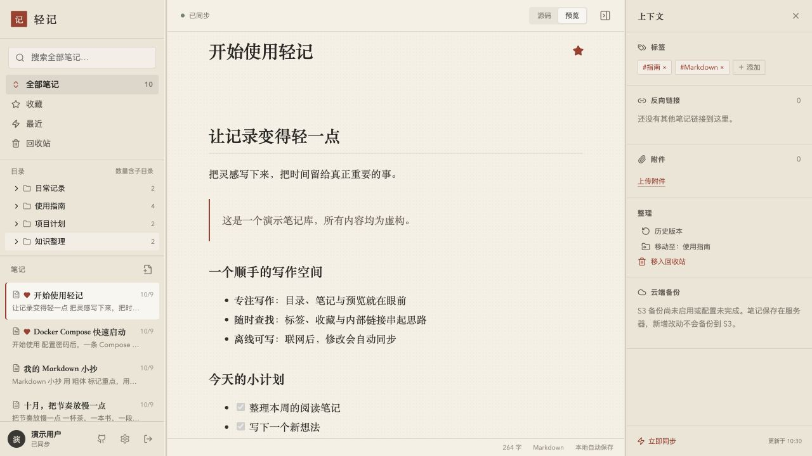
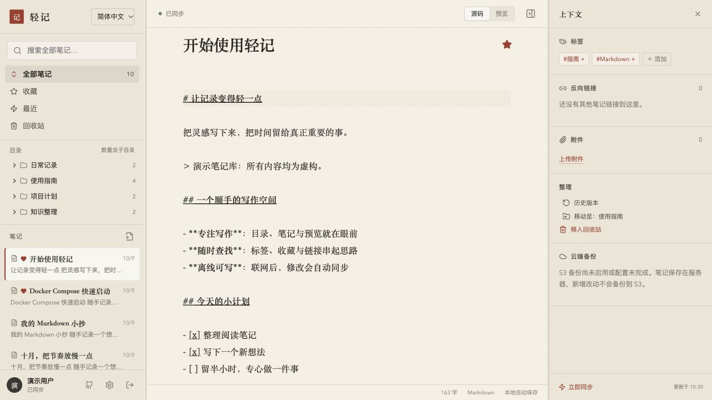
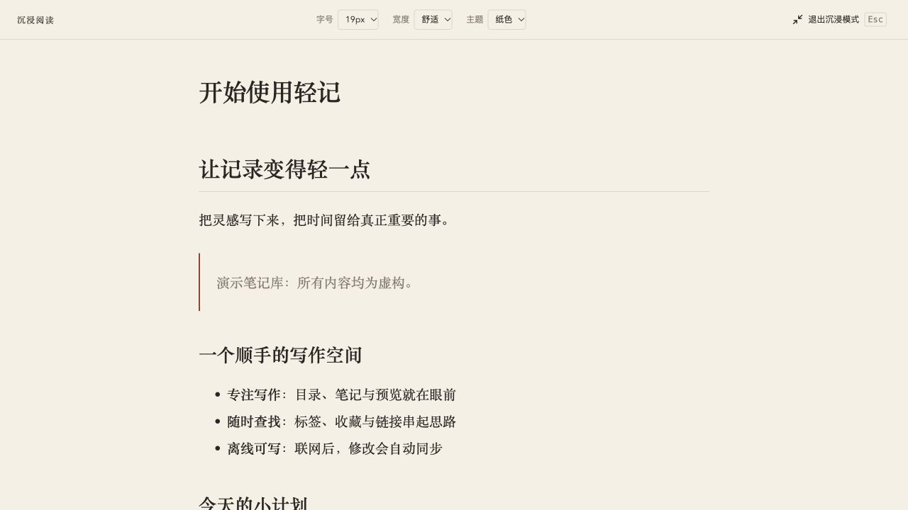

# 轻记 · Qingji

[简体中文](README.md) | [English](README.en.md) | [日本語](README.ja.md)

**一个更清爽、更顺手的 Joplin 平替。Docker Compose 部署，打开浏览器就能写，离线也能记。**

轻记面向个人 Markdown 笔记：把写作、检索、多设备同步和 S3 备份放进一个简洁的网页应用。部署一次，多台电脑直接访问同一个地址；笔记和附件留在自己的服务器，S3 按需启用。

## 界面实景

以下截图来自实际运行的轻记，使用独立演示笔记库；账号、笔记标题与正文均为虚构。

**正文预览** · 目录、笔记列表、阅读区与上下文面板集中在同一个工作台。



**Markdown 编辑** · 一键切换源码与预览，支持本地自动保存和增量同步。



## 为什么用轻记

- **好看，也好用。** 目录、笔记列表、编辑与预览集中在一个工作台，配合标签、收藏、内部链接和反向链接，少切换，多写作。应用名称和图片 Logo 也能自己改。
- **打开轻，切换快。** 目录与正文分开加载，正文按需读取；浏览器缓存已加载内容，目录索引在 Worker 中构建，静态资源压缩并缓存，减少反复加载和主线程工作。
- **写完就同步，不等 S3。** 本地改动约 650 毫秒后触发合并推送到服务端，按游标只拉取新增变化；多端写作不必等待对象存储备份完成。恢复联网自动补发，冲突保留副本。
- **离线也能继续写。** 已初始化的浏览器支持离线创建、编辑和删除，联网后增量同步。临时断网不会打断正文编辑。
- **S3 备份更节制。** 服务端合并多设备的修改，按内容哈希复用对象，只上传增量；无变化跳过新快照，日常复用哈希缓存，周期全量核对，减少重复读写、传输和校验工作。
- **部署简单，数据在手。** Docker Compose 一条启动命令，自动构建前后端、启动服务并检查健康状态。Markdown 与原始附件直接落盘，支持历史版本、回收站和完整导出。

## 沉浸阅读

点击文章工具栏的「进入沉浸模式」，收起目录、笔记列表和上下文面板，以居中的阅读排版显示正文。支持 16–26px 字号、舒适／宽屏两种宽度、纸色／白色／深色主题和阅读进度条；偏好保存在当前浏览器。页内搜索仍可用；按 Esc 或点击退出恢复原来的预览／源码模式与侧栏布局。搜索条打开时，第一次 Esc 先关闭搜索。



## 页内搜索

点击正文或进入编辑器后，按 **Ctrl+F**（Mac 也支持 **⌘F**）搜索当前笔记。源码模式搜索 Markdown 原文，预览模式搜索渲染后的正文；显示匹配数量并高亮命中，支持大小写选项、Enter／Shift+Enter 跳转和 Esc 关闭。切换模式保留关键词。焦点在侧栏等文章外区域时，仍使用浏览器默认搜索。

## 界面语言

支持简体中文、English 和日本語。首次按浏览器语言选择，不支持的语言回退到英语；可在登录页、工作台左上角或「设置 → 外观」中切换。选择保存在当前浏览器，无需刷新，不会自动翻译笔记正文、标题、标签或自定义应用名称。

## Docker Compose 快速部署

**准备 Git、Docker 和 Docker Compose，设置一个密码，就能启动。宿主机无需安装 Node.js、Python 或数据库。**

```bash
git clone https://github.com/gallonyin/qingji.git
cd qingji
cp .env.example .env
# 编辑 .env，把 MYNOTE_PASSWORD 换成自己的密码
# 默认配置适合在本机 http://localhost:8080 使用
docker compose up -d --build --wait
```

启动完成后打开 **<http://localhost:8080>**，用设置的密码登录即可。首次启动会下载基础镜像、安装依赖并构建应用；后续启动可直接运行 `docker compose up -d --wait`。默认数据保存在宿主机的 `./data/`，S3 不是启动前提，稍后在网页设置中配置即可。

常用操作：

```bash
docker compose logs -f        # 查看日志
docker compose stop           # 停止服务
docker compose up -d --wait   # 再次启动
```

部署到服务器时，将 `.env` 中的 `MYNOTE_ORIGIN` 设置为实际访问网页的完整 origin（协议、域名和非默认端口，不带路径）。公网使用 HTTPS 反向代理，并设置 `MYNOTE_COOKIE_SECURE=true`。离线刷新需要 HTTPS 或 localhost；普通 HTTP 远端页面不能启用 Service Worker。

升级前先停止服务并备份整个 `data/`，再拉取代码、运行 `docker compose up -d --build --wait`，让前后端一起升级。一个数据目录只能由一个服务进程写入，一个 S3 前缀只能有一个服务端负责。

## 从 Joplin 换过来，能得到什么

轻记优先解决的是**个人 Markdown 写作、多台电脑访问、自己部署和 S3 异地备份**。如果你已经习惯 Joplin 的笔记本、标签和内部链接，这里保留熟悉的组织方式，同时把日常流程做得更直接。

| 你在意的事 | 轻记的做法与收益 |
| --- | --- |
| 更清爽的写作体验 | 目录、列表、编辑和预览同屏，常用操作集中；围绕写作和查找组织界面。 |
| 换台电脑就能用 | 部署一个服务，浏览器打开即可；S3 配置只在服务端保存，各浏览器无需分别填写桶和密钥。 |
| 笔记打开与切换 | 目录元数据先行、正文按需加载、本地缓存复用，减少重复下载；已缓存的正文离线可编辑。 |
| 修改尽快到达其他设备 | 编辑后触发增量推送，联网自动补发；其他设备通过增量拉取获取变化，可见页面约每 30 秒检查，也支持手动立即同步。 |
| 不让 S3 拖慢日常同步 | 浏览器同步到服务端，服务端另行备份到 S3；对象存储响应时间不进入日常笔记同步路径。 |
| 减少重复对象与备份传输 | 相同内容按 SHA-256 复用对象，多份快照共享未变化的内容；合并连续修改，只上传新增内容对象。 |
| 更合理地安排校验 | 日常扫描元数据、复用已确认的哈希与上传记录；默认每 7 天到期后在下一次备份中全量核对，恢复时逐文件校验 SHA-256。 |
| 备份成本看得见 | 展示请求次数、实际传输量、耗时和阶段；压缩快照清单、条件请求与保留数量清理，让请求、流量和空间开销更可控。 |
| 迁移已有笔记 | 提供只读 Joplin 本地 profile 导入脚本，保留目录、标题、标签、附件和内部链接；原数据保留供核对。 |

Joplin 的 [S3 模式](https://joplinapp.org/help/apps/sync/s3/)把对象存储用作客户端同步目标；轻记把多设备同步与 S3 备份分开。这是轻记降低日常同步对 S3 的依赖、集中管理备份和减少重复工作的关键。这些机制减少可避免的读写与传输，让 S3 开销更可控；实际费用取决于笔记规模、修改频率、保留策略和服务商计价。

Joplin 也提供 [网页版](https://joplinapp.org/help/apps/web/)和 [端到端加密](https://joplinapp.org/help/apps/sync/e2ee/)。轻记当前专注单用户 B/S 笔记库，不提供端到端加密、Joplin 插件兼容或全部功能对等；实验 Tauri 壳尚未验证桌面发布包。

迁移入口：[从 Joplin 本地数据迁移](docs/migration-run.md)。建议先在独立实例核对笔记和附件，再切换日常使用。

## 应用设置

登录后点击左下角齿轮，可修改应用名称和图片 Logo，并配置可选 S3 备份。支持连接权限测试、自动备份与保留数量设置，保存后实时生效。账号区和关于页提供 [GitHub 项目入口](https://github.com/gallonyin/qingji)。详见 [设置说明](docs/settings.md)。

## 数据与备份

```text
data/
├── notes/                       # Markdown 当前笔记，包含回收站内容
├── attachments/                 # 原始附件
├── settings.json                # 外观和 S3 配置（含密钥，首次保存后生成）
├── metadata.sqlite              # 历史版本、会话、索引与同步记录
├── backup-jobs.json            # 后台任务
├── backup-cache.sqlite           # 增量备份缓存
└── backup-observability.sqlite   # 任务统计
```

Markdown 与附件保存当前内容。历史版本、会话和同步状态还依赖 SQLite；丢失数据库只能重建当前笔记索引，不能重建全部历史。

S3 是后端异地备份，与浏览器到服务端同步分开。默认关闭；可在设置页填写独立桶或前缀并启用，也可首次通过环境变量设置 `S3_BACKUP_ENABLED=true`，自动备份还需 `S3_BACKUP_SCHEDULE_ENABLED=true`。默认修改静默 60 秒后备份，持续修改最长等 10 分钟；每 24 小时检查待备份变更，无变化跳过。每 168 小时到期后在下一次备份中全量核对，不是每天全桶扫描。

默认保留最近 30 个普通快照，受保护快照额外保留；发布成功并验证清单后清理未引用对象。S3 当前仅包含 `notes/` 和 `attachments/`，**不包含历史数据库**。完整冷备需要停止服务后复制整个 `data/`，包括存在的 SQLite WAL/SHM 文件。恢复冷备也应停服务后整体替换，不能只替换运行中的数据库文件。

详见 [S3 备份](docs/s3-backup.md)、[恢复保护](docs/backup-safety.md)、[历史版本](docs/note-history.md)、[Joplin 迁移](docs/migration-run.md)。

## 已知边界

- 首台设备必须在线登录和初始化。离线附件上传暂不支持；正文编辑可以离线使用。缓存过的内容仍占用浏览器存储，退出登录不会自动清空缓存，公用电脑需另行清除站点数据。
- 不是多人协作工具，不提供权限隔离、公开分享、CRDT 或端到端加密。多个浏览器并发修改同篇笔记可能生成冲突副本。
- 默认 JSON 请求上限约 1 MiB，单附件上传上限 25 MiB；部分文件操作整文件读入内存，大附件和超大笔记不是当前优化目标。
- 搜索当前使用服务端内存扫描，首次同步需下载目录元数据。规模和性能应结合实际数据测量，不承诺任意数量笔记下恒定延迟。
- 备份建立本地一致快照时短暂排队写入，上传时可继续编辑；整库恢复期间服务端禁止写入。没有共享目录多进程锁或完整断电事务保证。

本轮发布准备的检查与限制见 [审核记录](docs/publication-review.md)。

参见 [安全边界](SECURITY.md)、[参与开发](CONTRIBUTING.md)、[文件格式](docs/data-format.md)、[同步协议](docs/sync-protocol.md)。

## 本地开发

要求 Node.js **20.19+**，推荐 Node.js 22；Python 3 仅用于迁移及其测试。

```bash
npm ci
cp .env.example .env
# 编辑 .env：将 MYNOTE_PASSWORD 改为自己的密码，示例密码不能启动服务
npm run dev
```

访问 <http://localhost:5173>。服务端监听 8787，网页通过 `/api` 代理访问。启动入口读取根目录 `.env`，已有进程环境变量优先。配置修改后重启服务。

```bash
npm run typecheck
npm test
npm run build
python3 -m unittest discover -s scripts/tests
npm audit --registry=https://registry.npmjs.org
```

## 许可证与兼容性

采用 [MIT](LICENSE) 许可证。展示名为轻记（Qingji）；已有 `MYNOTE_*` 配置、`@mynote/*` 工作区名、浏览器数据键及 S3 `mynote/` 前缀保留兼容，无需为改名迁移数据。
